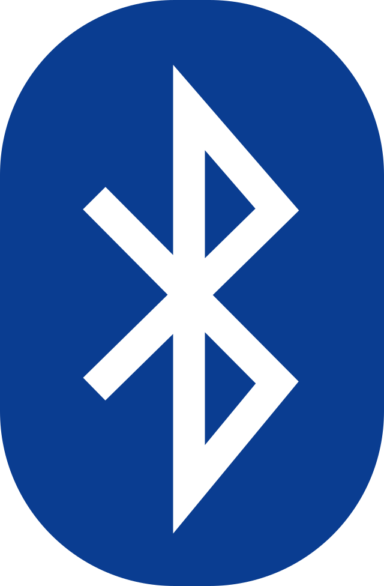
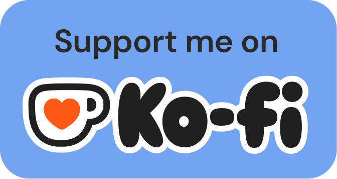

# Aplicación Web para Transferencia de Archivos Bluetooth 

<br>
Esta es una aplicación moderna de **Bluetooth Web** que permite:

- Conectar dos dispositivos Bluetooth usando servicios BLE personalizados
- Transferir archivos (divididos en partes de 512 bytes) entre dispositivos
- Ver el **Historial de Transferencias** (el historial es temporal y se elimina después de 20 días)
- Consultar el **Historial de Dispositivos** con todos los dispositivos conectados previamente
- Reproducir un sonido al emparejar o desconectar
- Usar la app sin conexión (PWA)
- Reproducir música directamente en el navegador (para auriculares)
- Monitorear datos de salud (para relojes)
- Jugar minijuegos (para controles)
- Interfaz compatible con móvil y escritorio

> ⚠️ Este proyecto utiliza la **API Web Bluetooth** experimental, que solo funciona en navegadores compatibles como **Chrome** y únicamente bajo **HTTPS** o `localhost`.

---

## 🔧 Funcionalidades

- 📂 Seleccionar y enviar archivos por Bluetooth (en partes de 512 bytes)
- 🕒 Pestaña de Historial de Transferencias (el historial se elimina automáticamente después de 20 días)
- 📋 Pestaña de Historial de Dispositivos (ver todos los dispositivos conectados)
- 🔊 Sonido al conectar o desconectar
- 🎵 Reproductor de música para auriculares
- 🩺 Monitoreo de salud para relojes
- 🎮 Minijuegos para controles
- 📥 Recibir datos mediante notificaciones BLE
- 📱 Compatible con dispositivos móviles y de escritorio
- ⚡ Funciona sin conexión (PWA)

---

## 📦 UUIDs Utilizados

Asegúrese de que su dispositivo BLE utilice los siguientes UUIDs:

```js
const SERVICE_UUID        = '8e7c12e0-5f9b-4b57-b6e0-07c58b4fd328';
const WRITE_CHAR_UUID     = '77f57404-5e34-42e7-9502-3f6a3a0e091b';
const NOTIFY_CHAR_UUID    = '4dd9a968-c64b-41cd-822c-b9e723582c4e';
```

---

## 🌐 Idiomas Disponibles

🇧🇷 [Português (PT-BR)](README-ptbr.md) | 🇺🇸 [English (EN)](README.md) | 🇪🇸 [Español (ES)](README-es.md) | 🇨🇳 [中文 (ZH)](README-zh.md) | 🇫🇷 [Français (FR)](README-fr.md)

---

## 🙏 ¡Gracias por el apoyo de todos!

[](https://star-history.com/#erikraft/Bluetooth-Center&Date)

---

## 💰 Soporte
<a href="https://ko-fi.com/erikraft" target="_blank">

</a>
<br />
<br />

Bluetooth Center es libre, y siempre lo será. \
Si te resulta útil y quieres apoyar el software libre y de código abierto, considera donar usando el botón de arriba. \
Yo pagué el dominio y el servidor, y puedes ayudar a crear y mantener un gran software apoyándome. \
¡Muchas gracias por tu contribución!
